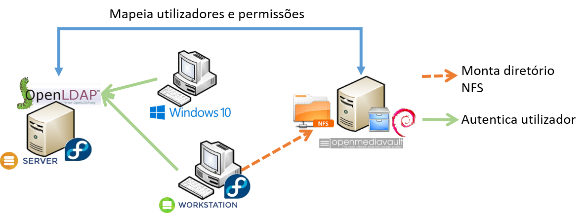

# Setup Explanation

This lab requires 4 virtual machines to be installed in order to run the lab. The following is a list of the virtual machines and their purpose:

**Fedora Server** - This server runs OpenLDAP and is used to authenticate users for the lab.

**Debian Server** - This server runs NFS and is used to store the files for the lab.

**Windows Server 2019 Client** - This client is used to connect and be authenticated in the OpenLDAP server.

**CentOS Client** - This client is used to connect and be authenticated in the OpenLDAP server, and to connect and mount the NFS server.

## Network Configuration

All machines are connected to the host machine via a virtual NAT (192.168.124.0/24). Besides that, another private network (10.20.0.0/24) exists which inter connects all the virtual machines. The following table shows the network configuration for each machine:

| Machine | NAT (192.168.124.0/24)  | Private Network (10.20.0.0/24) |
| ------- | --------- | --------- |
| Fedora Server | *DHCP* | 10.20.0.11 |
| Debian Server | *DHCP* | 10.20.0.12 |
| Windows 10 Client | *DHCP* | 10.20.0.13 |
| CentOS Client | *DHCP* | 10.20.0.14 |

## Virtual Machine Configuration

All virtual machines were created using the Virtual Machine Manager (virt-manager) and have the following credentials:

| Machine | Username | Password |
| ------- | --------- | --------- |
| Fedora Server | root | root |
| Debian Server | root | root |
| Windows 10 Client | auser | horseCACAnow |
| CentOS Client | auser | root |

